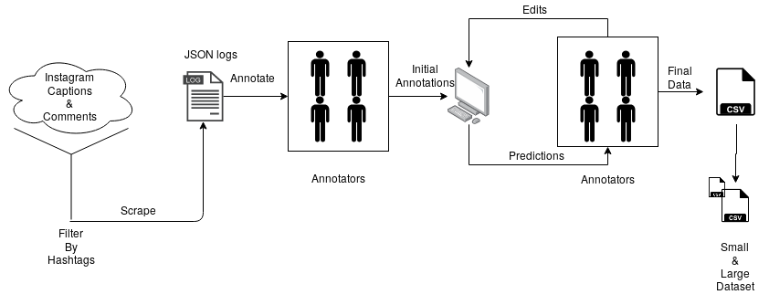
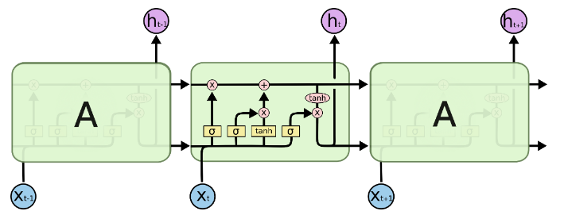
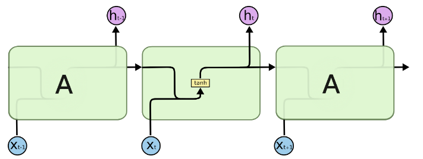
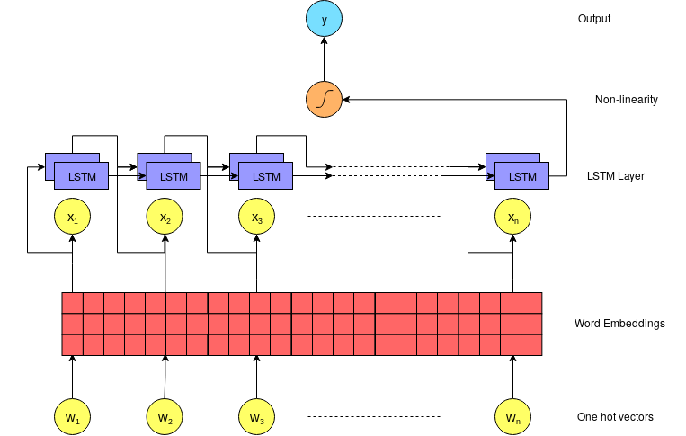
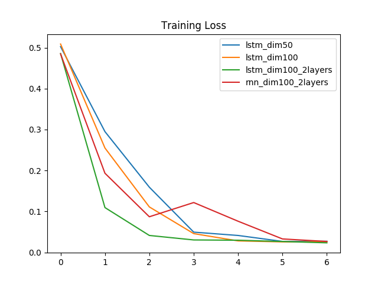
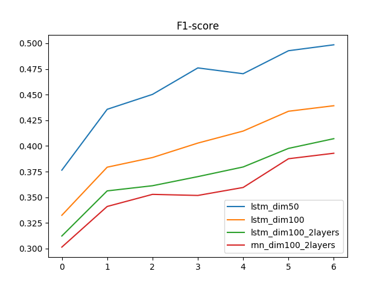
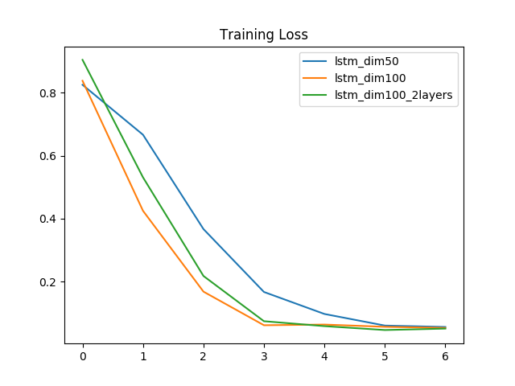
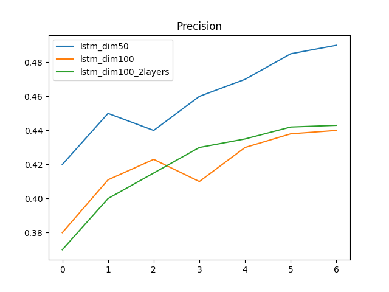
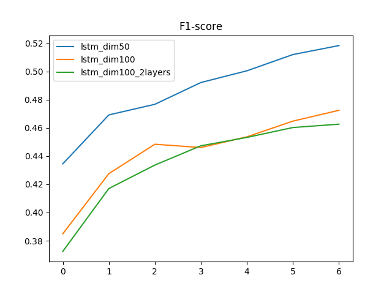

# Sexist Stereotype Classification

## Introduction

  Sexist stereotyping is a social phenomenon described as an over generalization of the attributes, behaviour, characteristics or features of a few people to their entire gender. In recent years, due to the rise in awareness campaigns, both on social media and in form of protests, it has come to light that sexism and sexist stereotyping is quite a common occurrence and it can have far reaching consequences on the victims and therefore must be curbed. The first step in curbing sexist stereotypes is to ask, "what makes a statement or comment sexist?" 

  In this project we turn to Instagram as a source of comments and try to answer the questions from a machine learning perspective: "what features can be extracted that determine that a comment is sexist?" We scrape Instagram captions and comments associated with multiple hashtags and cleaned it up. We annotated the data in a binary fashion (sexist or not), and created an active learning model to annotate the rest of the captions. Our next task is to create a finer classification guidelines and use that to extract some relevant features from the same.

## Dataset

### Collection and preprocessing

  The dataset was curated by scraping instagram posts by hashtags, using this [instagram-scraper](https://github.com/rarcega/instagram-scraper). The hashtags for which we scraped data for were bloodymen, boys, everydaysexism, girls, guys, manspalining, metoo, sexism, sexist and slutshaming.
  We scraped 10,100 posts in total, but some of them had captions just made of emojis and hashtags alone which can not be used, so we removed all such posts. In the end, we were left with captions and comments of 6238 posts. The entire dataset is available in this repository.

### Annotation guideline

The data was annotated based on a simple metric: Do these comments and captions pertain to sexism or not? A comment or caption is defined to pertain to sexism if it is either sexist itself (for example: "Women belong in the kitchen") or about sexism (for example: "I was told to shut up because women don't know science"). This binary classification was manually annotated for 200 captions and comments, with an inter-annotator agreement rate of 94% across four annotators.

Using the annotations, we then further classified the sexist instagram captions and comments based on role based and attribute based sexism. Role based sexism, also known as role stereotyping, refers to the generalization of false notions based on the idea that certain roles, occupations, professions and jobs are restricted only to men, and other are only to women. On the other hand, attribute based sexism or attribute stereotyping,  refers to physiological, psychological or behavioural qualities of men and women, to a degree of generalization that makes it untrue. 

It is also possible that the sexism may be a combination of both. However, due to the data skew on the number of sexist captions and comments, a combination of both would be difficult to identify and isolate, due to which it was not considered.

### Automated Data Annotation

We use a small pool of labeled data, approximately 200 captions and comments, which are manually annotated. On this, we apply an active learning mechanism, using margin based measures of SVMs measures based on class probability for classification. We calculate the 1-Entropy value, Margin, and MinMax as explained in this [paper](https://www.aclweb.org/anthology/C08-1059.pdf). In each round of AL, we select the ten tokens with the smallest value of the above.

The pipeline for Active Learning is as below:

The active learning procedure gave the highest F1 score of approximately 61% which can be attributed to the high skew in the dataset, primarily due to Instagram's strict community guidelines which reduces the number of sexist or toxic comments and captions. More importantly, a large amount of the sexist and sexism data in the dataset consists of stories of sexism, which are usually much longer than the usual caption or comment, skewing the data considerably.

## Methodology

In this section, we describe the classifier design based on which the classification of the captions and comments is done. First, we have a binary classification for whether the given comment is sexist or not sexist. Then we show the design of multi-class classifier for attribute stereotyping, role stereotyping and non-stereotyped data. We use [GloVe embeddings of 300 dimensions](https://nlp.stanford.edu/projects/glove/) for both the classification tasks.

Figures below show the internal representation of a single RNN cell and a single LSTM cell:

#### LSTM cell

#### RNN cell

### Binary Classification

For binary classification, we used a combination of recurrent networks followed by a softmax classifier. The classifier design was not considered more intricate due to the constraints on the data as mentioned above.

A recurrent network can be either an RNN (recurrent neural network) or an LSTM (long short term memory). Recurrent models are used in this project as they capture features of the previous cell as well as the current input, weighted on a non-linearity, usually a tanh function. Here we use simple many-to-one recurrent model of size 100 dimensions. The difference in performance for RNNs and LSTMs comes from the fact that LSTMs have three gates which determine what information should be retained from the previous hidden states and what information should be discarded. LSTMs are preferred over RNNs in order to solve the vanishing gradient problem.

We run four experiments, a single LSTM of 50 and 100 dimensions, an two layer RNN of 100 dimensions and a two layer LSTM of 100 dimensions. The results of the experiments are given in the section below.

### Multiclass Classification Model

For multi-class classification, we use a slightly more complicated model of a stacked LSTM. A stacked LSTM has multiple sequences of LSTMs in a stack, such that for the second layer onwards, the input is not the embedding, but the hidden state of the previous layer. The diagram below shows this configuration of stacked LSTMs.

#### Architecture

## Results and Analysis

### Binary Classification

We can see in table below where the precision, recall and F1 values of the binary classification experiment are provided. We see two important observations here. First, we see that the lower dimension single layer LSTM performs the best despite being the simplest model.

This is for two main reasons, which are as follows:

* The number of data points on training are quite few, and the ratio of positive to negative samples are quite skewed. This causes larger models to overfit, and because of that the larger the model in dimension size, the worse it performs.
* The data is skewed in more than one way. The comments which are sexist stereotypes tend to be much longer than those which are not sexist, specifically because the instagram scraping methodology only allows for scraping based on hashtags. 

| Model                                | Recall | Precision | F1 \-Score | Accuracy |
|--------------------------------------|--------|-----------|------------|----------|
| Single Layer LSTM \(50 dimensions\)  | 0\.59  | 0\.43     | 0\.49      | 0\.70    |
| Single Layer LSTM \(100 dimensions\) | 0\.50  | 0\.39     | 0\.44      | 0\.62    |
| Two Layer LSTM \(100 dimensions\)    | 0\.45  | 0\.36     | 0\.41      | 0\.58    |
| Single Layer RNN \(100 dimensions\)  | 0\.43  | 0\.37     | 0\.39      | 0\.57    |

We show the graphs of precision, recall, accuracy and F1-score of the binary classification experiment below. The effect of data overfitting is seen almost immediately. Further, note that sparsity and skew in the dataset requires better training data. Higher accuracies may be achieved by working with the better data.

Recall            |  Precision
:-------------------------:|:-------------------------:
 | 
Accuracy            |  F1-score
 | 

### Mutli-class Classification

The table below shows the results of the multiclass classification experiment. Again here we see that the simplest model performs the best. We also see that using a stacked LSTM shows a slight increase in performance, but the model runs the risk of overfitting.

| Model                                | Recall | Precision | F1 \-Score | Accuracy |
|--------------------------------------|--------|-----------|------------|----------|
| Single Layer LSTM \(50 dimensions\)  | 0\.55  | 0\.49     | 0\.518     | 0\.605   |
| Single Layer LSTM \(100 dimensions\) | 0\.51  | 0\.44     | 0\.472     | 0\.535   |
| Two Layer LSTM \(100 dimensions\)    | 0\.484 | 0\.443    | 0\.462     | 0\.513   |

We also show the loss values of each of the models, binary and multi-class classification. We see that while the loss falls most quickly for the model that stabilizes quickest, based on which the local minima is achieved. While the local minima is not the best performing, the model learns certain charcteristics of the data, such as the use of certain terms, length of caption or comment and so on.

Recall            |  Precision
:-------------------------:|:-------------------------:
 | 
Accuracy            |  F1-score
 | 

## Conclusion

In this project, we performed a study into the classification of Instagram captions and comments. We first annotated the data using a set of well formed guidelines. The deprecating API provided by Instagram inhibits the process the scraping the data off the site and they delete any comments or posts that are reported within a short period. This lead to a small number of sexist posts in our dataset to start with.

With this dataset, we started off with a manual annotation of small number of posts, and using this seed data, we then used an active learning classifier in order to classify a large number of captions and comments. We cross verified the tags to see if the tags were right.

We then experimented with different classifiers, where an LSTM classifier with only $50$ hidden layer dimension performed the best compared to higher dimension, or multi-layer classifier, even though we made sure that the training set had equal distribution between the 2 classes, for both binary and hierarchical classifier. This can be attributed to the skewed dataset that we have for this task. Further work over here would be to expand the dataset to include more sexist posts/captions.

The further work in this would be first to better the dataset by including more sexist captions. We can also identify more classes in the sexist types in the dataset, such as slut shaming, mansplaining, etc. The next step would be to experiment with other classifiers like Bi-LSTM, CNN, CNN-biLSTM-Attention, Hierarchical-biLSTM-Attention, and BERT, and with GloVe Twitter embedding along with GloVe Wikipedia.

## Complete Report

The complete report can be found [here](https://drive.google.com/file/d/1ioXSm3dWoSF00Z3TjhdgCie4yebOwjra/view?usp=sharing).

## Video Presentation

